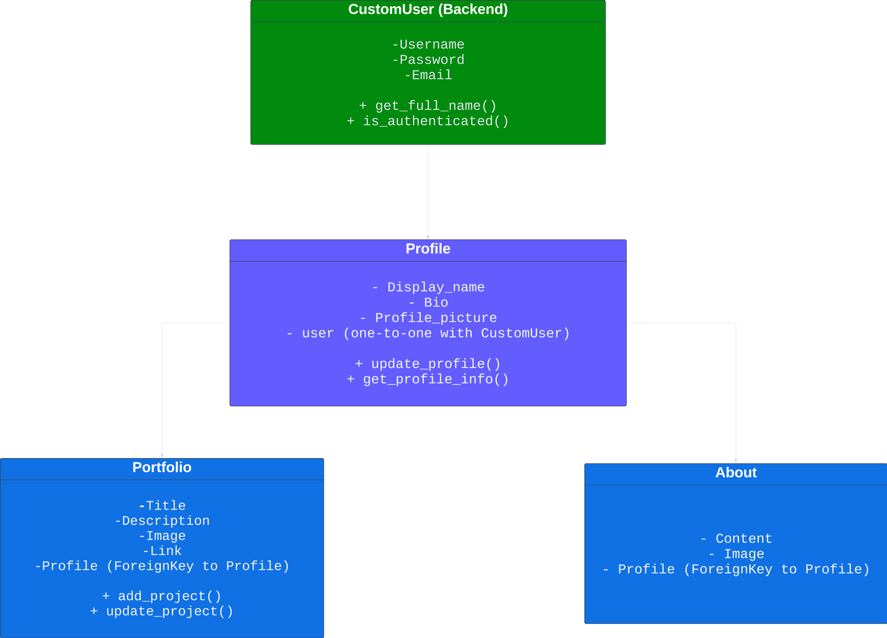

# Portfolio API Backend

Portfolio Backend is a Django REST API that supports the Portfolio Client application, enabling user authentication, profile management, and portfolio item management.

The objective of this backend is to provide a robust and secure API for managing user profiles and portfolio items.

## Table of Contents

- [Project Goals](#project-goals)
- [User Story](#user-story)
- [Class Diagram](#class-diagram)
- [Features](#features)
- [API Endpoints](#api-endpoints)
- [Testing](#testing)
- [Technologies Used](#technologies-used)
- [Deployment](#deployment)
- [Credits](#credits)

## Project Goals

- Provide secure and efficient user authentication.
- Enable users to manage their profiles and portfolio items.
- Ensure the API is responsive and easily integrable with the frontend.

## User Story

- As a user, I want to register and log in using both email and social media accounts.
- As a user, I want to manage my profile information.
- As a user, I want to add, edit, and delete my portfolio items.
- As a user, I want to view my portfolio items in a well-organized manner.

## Class Diagram

    
Click to see Class Diagram

    

## Features

- User authentication with JWT and social logins.
- User profile management.
- Portfolio item management.
- Responsive API for frontend integration.

## API Endpoints

  
Click to view API Endpoints

### Authentication
- `/api/auth/register/` - User registration
- `/api/auth/login/` - User login
- `/api/auth/logout/` - User logout
- `/api/auth/social/google/` - Google login
- `/api/auth/social/facebook/` - Facebook login

### Profile
- `/api/profile/` - Retrieve and update user profile

### Portfolio
- `/api/portfolio/` - List, create, update, and delete portfolio items
- `/api/portfolio/:id/` - Retrieve, update, and delete a specific portfolio item

## Testing

### Unit Tests

- Models, views, and serializers have comprehensive unit tests to ensure robustness.

  
Click to view Manual Tests

| Test Case # | Description                       | Steps                                             | Expected Result                                    | Actual Result |
|-------------|-----------------------------------|--------------------------------------------------|--------------------------------------------------|---------------|
| 1           | User Registration                 | 1. Navigate to "/api/auth/register". 2. Submit registration form. | User is registered and JWT token is issued.       | Works         |
| 2           | User Login                        | 1. Navigate to "/api/auth/login". 2. Submit login form. | User is authenticated and JWT token is issued.    | Works         |
| 3           | Add Portfolio Item                | 1. Navigate to "/api/portfolio/". 2. Submit new portfolio item. | New item is added to the portfolio.               | Works         |

## Technologies Used

### Languages

- Python
- JavaScript (for frontend integration)

### Frameworks and Libraries

- Django
- Django REST framework
- dj-rest-auth
- django-allauth
- djangorestframework-simplejwt

## Deployment

- Docker for containerized deployment.
- CI/CD pipeline setup for automated deployments.

## Credits

- Various code snippets and inspirations from open-source projects and tutorials.
